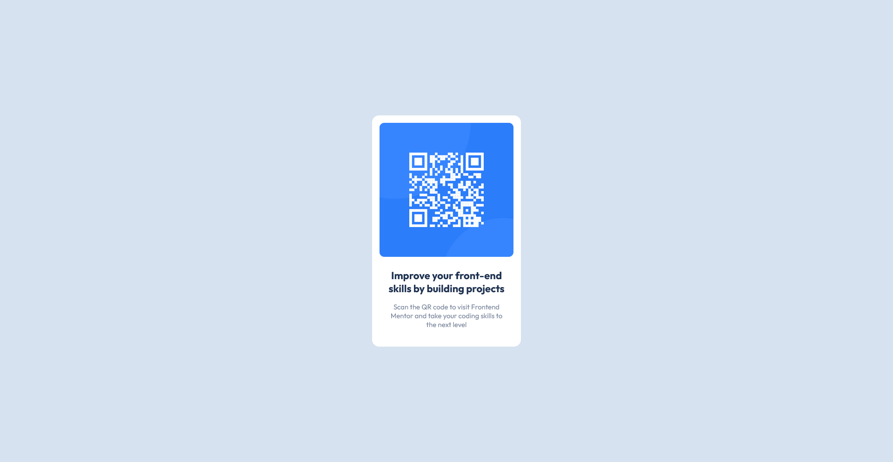

# Frontend Mentor - QR Code Component Solution

This is a solution to the [QR code component challenge on Frontend Mentor](https://www.frontendmentor.io/challenges/qr-code-component-iux_sIO_H). Frontend Mentor challenges help you improve your coding skills by building realistic projects. 

## Table of contents

- [Overview](#overview)
  - [Screenshot](#screenshot)
  - [Links](#links)
- [My process](#my-process)
  - [Built with](#built-with)
  - [What I learned](#what-i-learned)
  - [Continued development](#continued-development)
  - [Useful resources](#useful-resources)
- [Author](#author)
- [Acknowledgments](#acknowledgments)

## Overview

This is my first Frontend Mentor challenge coded in HTML and CSS. The card layout doesn't shift, so this is ideal for learning about building responsive layouts.

### Screenshot

- Desktop view


- Mobile view


### Links

- Solution URL: [https://github.com/kanishkasubash/frontend-mentor-challenges/edit/main/qr-code-component](https://github.com/kanishkasubash/frontend-mentor-challenges/edit/main/qr-code-component/build)
- Live Site URL: [https://kanishkasubash.github.io/qr-code-component/](https://kanishkasubash.github.io/qr-code-component/)

## My process

### Built with

- Semantic HTML5 markup
- [sass](https://sass-lang.com/) - Syntactically Awesome Style Sheets
- [Node.js](https://nodejs.org/en) - JavaScript runtime
- [Gulp.js](https://gulpjs.com/) - JavaScript toolkit
- Flexbox
- Mobile-first workflow

### What I learned

Semantic HTML5 markup
```html
<main class="container">
  <div class="card">
    
    <h1 class="card__heading">Improve your front-end skills by building projects</h1>
    <p class="card__description">Scan the QR code to visit Frontend Mentor and take your coding skills to the next level</p>
   </div>
</main>
```
define variables
```scss
:root {
    --font-outfit: 'Outfit', sans-serif;

    --bg: hsl(212, 45%, 89%);
    --bg-text: hsl(0, 0%, 7%);
    --card-bg: hsl(0, 0%, 100%);    
    --text-heading: hsl(218, 44%, 22%);
    --text-paragraph: hsl(220, 15%, 55%);
    --attribution: hsl(228, 45%, 44%);
}
```
function for convert pixels to rem
```scss
@use "sass:math";

@function rem($pixels, $context: 16) {
    @return (math.div($pixels, $context)) * 1rem;
}
```
base Style Sheet
```scss
html {
    font-size: 100%;
    box-sizing: border-box;
}

*, *::before, *::after {
    box-sizing: inherit;
}

body{
    margin: 0;
    padding: 0;
    font-family: var(--font-outfit);
    background: var(--bg);
    color: var(--bg-text);
}
footer {
    padding: rem(25);
}
```
typograpy Style Sheet
```scss
h1 {
    margin-top: 0;
    font-size: rem(20);
    font-weight: 700;
    color: var(--text-heading);
}

p {
    font-size: rem(15);
    font-weight: 400;
    color: var(--text-paragraph);
}

a, a:visited, a:active {
    text-decoration: none;
}
```
The Flexible Box Layout Module, makes it easier to design flexible responsive layout structure without using float or positioning.
```scss
.container {
    height: 100vh;
    display: flex;
    align-items: center;
    justify-content: center;    
}

.card {
    max-width: rem(320);
    background-color: var(--card-bg);
    border-radius: rem(15);
    text-align: center;
    &__image {
        width: 90%;
        border-radius: rem(10);
        margin: 5%;
    }

    &__heading {
        margin: 0 5%;
        padding: 0 5%;
    }

    &__description {
        margin: 5% 5% 13%;
        padding: 0 5%;
    }
}
```

### Continued development

flexible responsive layout that I want to continue focusing on in future projects. This technique I found useful that I want to refine and perfect.

### Useful resources

- [When to use Flexbox and when to use CSS Grid](https://blog.logrocket.com/css-flexbox-vs-css-grid/#css-grid-layout-flexbox-alignment)
- [Flexbox vs CSS Grid](https://www.youtube.com/watch?v=3elGSZSWTbM)
- [Use fonts Locally](https://www.youtube.com/watch?v=zK-yy6C2Nck)
- [Use fonts Locally](https://fontsource.org/fonts/outfit/install)
- [Flexbox](https://www.w3schools.com/css/css3_flexbox.asp)

## Author

- Website - [Kanishka Priyashantha](https://github.com/kanishkasubash)
- Frontend Mentor - [@kanishkasubash](https://www.frontendmentor.io/profile/kanishkasubash)
- Linkedin - [Kanishka Priyashantha](https://www.linkedin.com/in/kanishka-priyashantha-ab55289b)

## Acknowledgments

I have got some inspirations from:

- Jess Chan - [@TheCoderCoder](https://coder-coder.com/)
- freecodecamp - [https://www.freecodecamp.org](https://www.freecodecamp.org/)
- Aman Singh Bhogal - [https://www.frontendmentor.io/profile/asbhogal](https://www.frontendmentor.io/profile/asbhogal)
