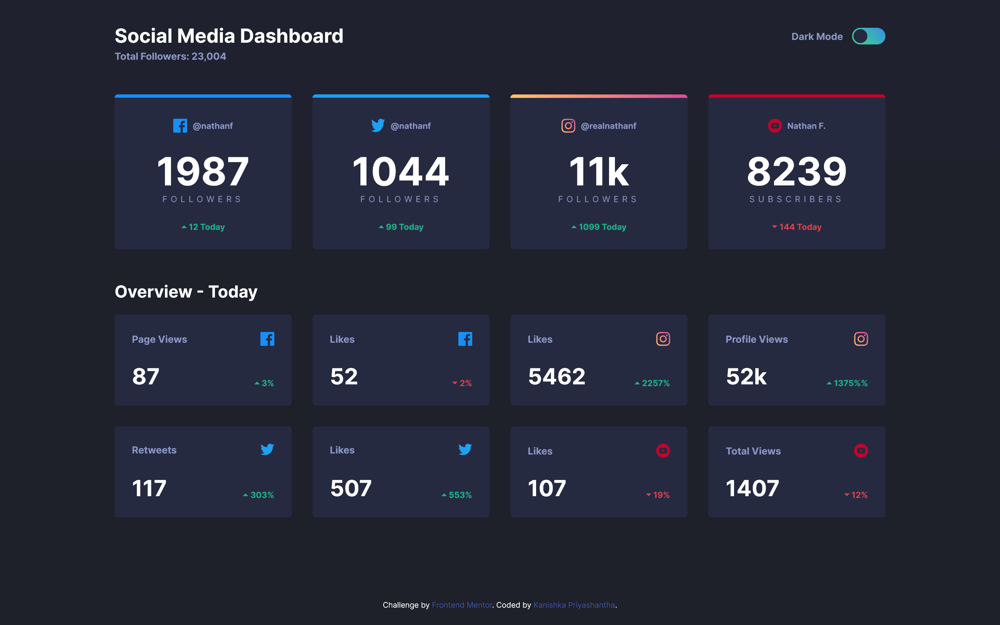
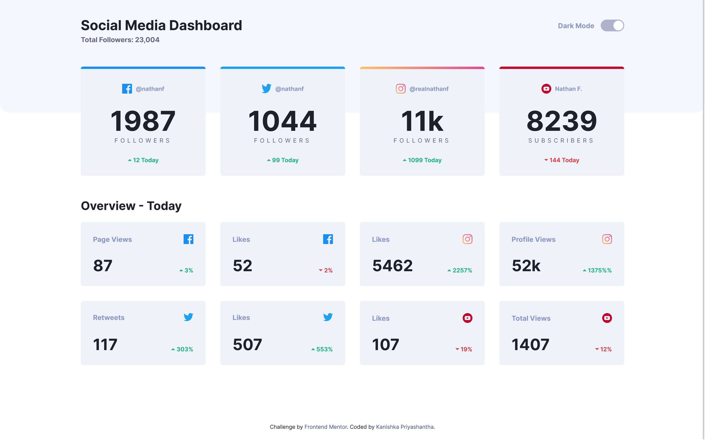
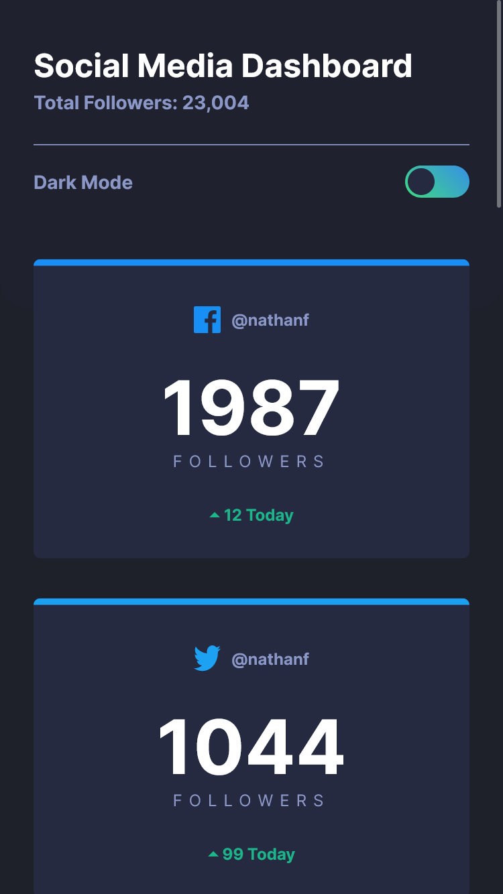
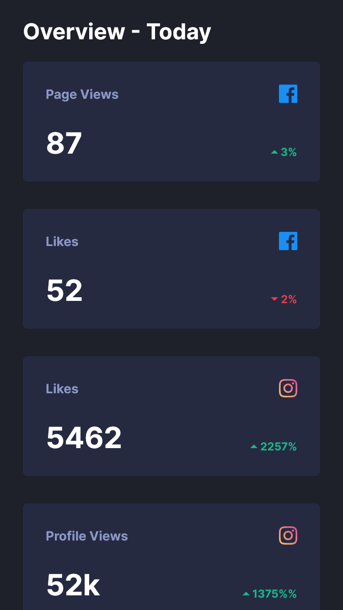
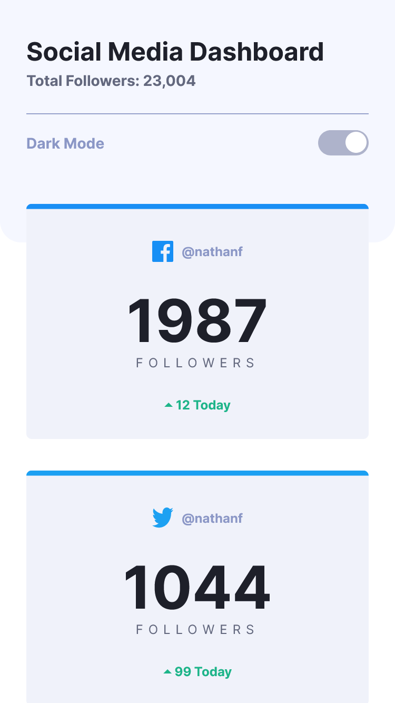
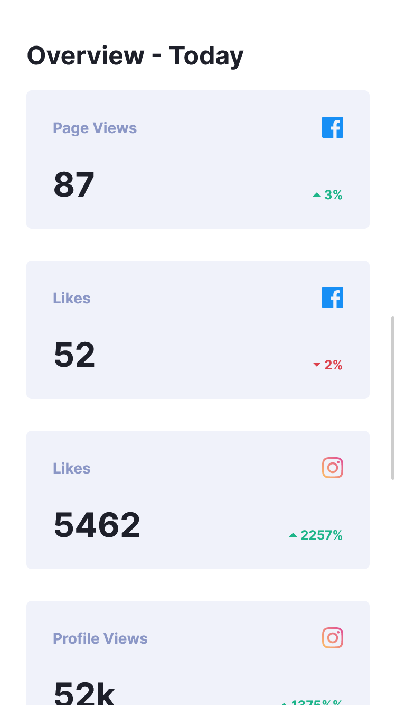

# Frontend Mentor - Social Media Dashboard with Theme Switcher

This is a solution to the [Social media dashboard with theme switcher challenge on Frontend Mentor](https://www.frontendmentor.io/challenges/social-media-dashboard-with-theme-switcher-6oY8ozp_H). Frontend Mentor challenges help you improve your coding skills by building realistic projects.

## Table of contents

- [Overview](#overview)
  - [Screenshot](#screenshot)
  - [Links](#links)
- [My process](#my-process)
  - [Built with](#built-with)
  - [What I learned](#what-i-learned)
  - [Continued development](#continued-development)
  - [Useful resources](#useful-resources)
- [Author](#author)
- [Acknowledgments](#acknowledgments)

## Overview

The challenge is to build out this Social Media Dashboard and get it looking as close to the design as possible. To do this challenge, I need a basic understanding of HTML, CSS and a tiny bit of JavaScript.

### Screenshot

- Desktop view - Dark

  

- Desktop view - Light

  

- Mobile view - Dark

  
  

- Mobile view - Light

  
  

### Links

- Solution URL: [https://github.com/kanishkasubash/frontend-mentor-challenges/edit/main/social-media-dashboard](https://github.com/kanishkasubash/frontend-mentor-challenges/tree/main/social-media-dashboard/build)
- Live Site URL: [https://kanishkasubash.github.io/social-media-dashboard/](https://kanishkasubash.github.io/social-media-dashboard/)

## My process

### Built with

- Semantic HTML5 markup
- [sass](https://sass-lang.com/) - Syntactically Awesome Style Sheets
- [Node.js](https://nodejs.org/en) - JavaScript runtime
- [Gulp.js](https://gulpjs.com/) - JavaScript toolkit - (Task Runner)
- Flexbox
- CSS Grid
- Mobile-first workflow

### What I learned

Toggle Button HTML5 markup

```html
<div class="header__toggle toggle">
  <label for="toggle" class="toggle__label">Dark Mode</label>
  <input type="checkbox" class="toggle__button" id="toggle" />
  <label for="toggle" class="toggle__background">
    <span class="toggle__slider"></span>
  </label>
</div>
```

Toggle Button Style scss

```scss
.toggle {
    &__label {
        font-size: rem(14);
        font-weight: 700;
        color: var(--dark-text);
        margin-right: rem(13);
    }

    &__button {
        opacity: 0;
        position: absolute;
    }

    &__background {
        background: linear-gradient(225deg, var(--toggle-start), var(--toggle-end));
        width: rem(48);
        height: rem(24);
        border-radius: rem(12);
        position: relative;
        padding: rem(5);
        cursor: pointer;
        display: flex;
        justify-content: space-between;
        align-items: center;

        &:hover {
            background: linear-gradient(225deg, var(--toggle-bg-start), var(--toggle-bg-end));
        }
    }

    &__slider {
        background-color: var(--toggle-slider);
        width: rem(20);
        height: rem(20);
        position: absolute;
        left: rem(2);
        top: rem(2);
        border-radius: 50%;
        transition: 0.4s;
    }

    #toggle:checked~.toggle__background {
        background: linear-gradient(var(--toggle), var(--toggle));

        &:hover {
            background: linear-gradient(225deg, var(--toggle-bg-start), var(--toggle-bg-end));
        }
    }

    #toggle:checked~.toggle__background .toggle__slider {
        transform: translateX(rem(24));
        background-color: var(--light-bg);
    }
}
```

Toggle Button JS

```js
const toggle = document.querySelector("#toggle");
const prefersColorScheme = window.matchMedia("(prefers-color-scheme: dark)");
const currentMode = localStorage.getItem("mode");

if (currentMode == "dark") {
    document.body.classList.toggle("dark-mode");
} else if (currentMode == "light") {
    document.body.classList.toggle("light-mode");
}

toggle.addEventListener("change", function () {
    var mode;
    if (prefersColorScheme.matches) {
        document.body.classList.toggle("light-mode");
        mode = document.body.classList.contains("light-mode")
            ? "light"
            : "dark";
    } else {
        document.body.classList.toggle("dark-mode");
        mode = document.body.classList.contains("dark-mode")
            ? "dark"
            : "light";
    }
    localStorage.setItem("mode", mode);
});
```

### Continued development

- React is one of the most widely used frontend libraries for building user interfaces. It follows a component-based architecture, making it efficient for creating reusable UI components. React's ecosystem is vast, with a rich selection of third-party libraries and tools. It's great for building interactive and dynamic single-page applications (SPAs).
- Vite is a local development server written by Evan You and used by default by Vue and for React project templates. It has support for TypeScript and JSX.

  These techniques I found useful that I want to refine and perfect.

### Useful resources

- [Flexbox](https://www.w3schools.com/css/css3_flexbox.asp)
- [When to use Flexbox and when to use CSS Grid](https://blog.logrocket.com/css-flexbox-vs-css-grid/#css-grid-layout-flexbox-alignment)
- [Flexbox vs CSS Grid](https://www.youtube.com/watch?v=3elGSZSWTbM)

## Author

- Github - [Kanishka Priyashantha](https://github.com/kanishkasubash)
- Frontend Mentor - [@kanishkasubash](https://www.frontendmentor.io/profile/kanishkasubash)
- Linkedin - [Kanishka Priyashantha](https://www.linkedin.com/in/kanishka-priyashantha-ab55289b)

## Acknowledgments

I have got some inspirations & lot of helpfull tips from:

- Jess Chan - [@TheCoderCoder](https://coder-coder.com/)
- freecodecamp - [https://www.freecodecamp.org](https://www.freecodecamp.org/)
- Aman Singh Bhogal - [https://www.frontendmentor.io/profile/asbhogal](https://www.frontendmentor.io/profile/asbhogal)
- Kevin Powell - [https://www.youtube.com/@KevinPowell](https://www.youtube.com/@KevinPowell)
