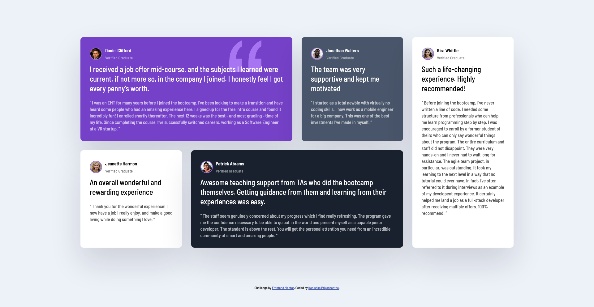

# Frontend Mentor - Testimonials grid section solution

This is a solution to the [Testimonials grid section challenge on Frontend Mentor](https://www.frontendmentor.io/challenges/testimonials-grid-section-Nnw6J7Un7). Frontend Mentor challenges help you improve your coding skills by building realistic projects. 

## Table of contents

- [Overview](#overview)
  - [The challenge](#the-challenge)
  - [Screenshot](#screenshot)
  - [Links](#links)
- [My process](#my-process)
  - [Built with](#built-with)
  - [What I learned](#what-i-learned)
  - [Useful resources](#useful-resources)
- [Author](#author)
- [Acknowledgments](#acknowledgments)

## Overview

Challenge is to build out this testimonials grid section and get it looking as close to the design as possible.

Users should be able to:

- View the optimal layout for the site depending on their device's screen size

### Screenshot

- Desktop view


### Links

- Solution URL: [https://github.com/kanishkasubash/frontend-mentor-challenges/tree/main/testimonials-grid-section](https://github.com/kanishkasubash/frontend-mentor-challenges/tree/main/testimonials-grid-section)
- Live Site URL: [https://kanishkasubash.github.io/testimonials-grid-section/](https://kanishkasubash.github.io/testimonials-grid-section/)

## My process

### Built with

- Semantic HTML5 markup
- BEM
- Flexbox
- CSS Grid
- Mobile-first workflow

### What I learned

BEM stands for "Block Element Modifier," and it is a naming convention and methodology for writing clean, maintainable, and scalable CSS and HTML code. BEM is particularly popular in the world of front-end web development because it helps create a clear and structured way to name CSS classes and define the relationships between different elements in your HTML and CSS.

The :nth-of-type() selector in CSS is a pseudo-class that allows you to select and style elements based on their position within a parent container. It targets elements that are of a specified type (e.g., HTML tag name) and match a certain position within their parent.

```html
<main class="testimonials">
    <div class="card card--bg-purple">
      <header class="card__header">
        
        <div>
          <h1>Daniel Clifford</h1>
          <p>Verified Graduate</p>
        </div>
      </header>
      <p class="card__lead"> I received a job offer mid-course, and the subjects I learned were current, if not more so,
        in the company I joined. I honestly feel I got every penny’s worth. </p>
      <p class="card__quote"> “ I was an EMT for many years before I joined the bootcamp. I’ve been looking to make a
        transition and have heard some people who had an amazing experience here. I signed up for the free intro course
        and found it incredibly fun! I enrolled shortly thereafter. The next 12 weeks was the best - and most grueling -
        time of my life. Since completing the course, I’ve successfully switched careers, working as a Software Engineer
        at a VR startup. ” </p>
    </div>
</main>
```
```css
.testimonials {
    max-width: 1440px;
    margin: 100px auto;
    padding: 20px;
    display: grid;
    grid-template-columns: repeat(4, 1fr);
    gap: 30px;
}

.card {
    background: #fff;
    border-radius: 10px;
    padding: 30px;
    box-shadow: rgba(17, 12, 46, 0.15) 0px 48px 100px 0px;
}

.card__header {
    display: flex;
    align-items: center;
    margin-bottom: 10px;
}

.card__header h1 {
    font-size: 0.9375rem;
}

.card__header p {
    opacity: 50%;
}

.card__img {
    width: 40px;
    height: 40px;
    border-radius: 50%;
    border: 2px solid #996ed9;
    margin-right: 10px;
}

.card__lead {
    font-size: 1.5rem;
    font-weight: 500;
    line-height: 1.3;
    margin-bottom: 20px;
}

.card__quote {
    font-size: 0.9375rem;
    font-weight: 500;
    line-height: 1.4;
    opacity: 70%;
}

.card--bg-purple {
    background: hsl(263, 55%, 52%);
    color: #fff;
    background-image: url(./images/bg-pattern-quotation.svg);
    background-repeat: no-repeat;
    background-position: top 10px right 100px;
}

.card:nth-of-type(1) {
    grid-column: 1 / 3;
}

@media (max-width: 768px) {
    .testimonials {
        grid-template-columns: 1fr;
        width: 100%;
    }

    .card:nth-of-type(1) {
        grid-column: 1;
    }
}
```

### Useful resources

- [When to use Flexbox and when to use CSS Grid](https://blog.logrocket.com/css-flexbox-vs-css-grid/#css-grid-layout-flexbox-alignment)
- [Flexbox vs CSS Grid](https://www.youtube.com/watch?v=3elGSZSWTbM)

## Author

- Github - [Kanishka Priyashantha](https://github.com/kanishkasubash)
- Frontend Mentor - [@kanishkasubash](https://www.frontendmentor.io/profile/kanishkasubash)
- Linkedin - [Kanishka Priyashantha](https://www.linkedin.com/in/kanishkasubash)
- Twitter - [@kanishkasubash](https://twitter.com/kanishkasubash)

## Acknowledgments

I have got some inspirations & lot of helpfull tips from:

- Brad Traversy - [https://www.traversymedia.com/](https://www.traversymedia.com/)
- Aman Singh Bhogal - [https://www.frontendmentor.io/profile/asbhogal](https://www.frontendmentor.io/profile/asbhogal)
- Kevin Powell - [https://www.youtube.com/@KevinPowell](https://www.youtube.com/@KevinPowell)
